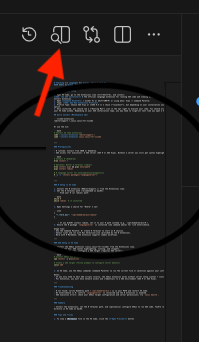

# Teaching Old Languages New Tricks: SAS & R meet AI
#### BEDAC Workshop, January 2026


## Prerequisites

- **R** runtime: Install from CRAN.
- **SAS** access (for execution): SAS 9 or SAS Viya. Without a SAS server you still get syntax highlighting and linting for SAS.


## SAS Extension Setup

1. In VS Code, go to the Extensions view (`Ctrl+Shift+X` or `CMD+Shift+X` or find and "Extensions" icon on the left of your screen), and type **SAS**.  
Select **SAS: (by SAS Institute)** – The official language extension for running SAS code and viewing datasets.  
Install extension.
2. Open **Command Palette**: ( either `F1` or `Shift+CMD+P`) or using menu: `View -> Command Palette`;
3. Type: **SAS: Add New Connection Profile**
4. Profile Type: Choose SAS Viya or **SAS 9.4 ** I chose *"localhost"*, but depending on your installation you might need to select a different option. 
5. Once installed, you should see a *"Running Man"* icon in the opt right to execute your code. You should also see a **SAS** logo on the left-side of your VS Code window. Depending on your SAS installation type, you may need to *sigh-in* next time you open a VS Code.


## R Extension Setup

1. In VS Code, go to the Extensions view (`Ctrl+Shift+X` or `CMD+Shift+X` or find and "Extensions" icon on the left of your screen), and type **"R"** (make sure you use quotes around R) : 
Select **R: (by REditorSupport)** – Provides syntax highlighting, linting, and package management. Install this extension. If you are asked if you would like to install a **"languageserver"** R package during this process, select *"Yes"*. If this option does not appear during installing this extension, make sure you install this R package afterwards. 
2. I recomment that you also install the **"R Debugger"** and **"R Syntax"** extensions as well;
3. If you previously have not been asked to install the **languageserver** package, you need to install it now. Open a terminal window (if it is not opened already) and start R, by typing `R` at the prompt. Once R session has started, you can type `install.packages("languageserver")`
4. **Troubleshooting** If you are unable to start an R session, you may need to specify the path to where R is installed on your computer. Find the Path to your R installation. On Mac, you can open a terminal window and type: `which R`. On a Windows computer, open `R` or `RStudio` and in the Console window type `R.home("bin")`. Copy this path and then open a *"Command Palette"* window and type `Preferences: Open User Settings (JSON)` and select the corresponding line. Make sure you select the `(JSON)` option, not the `(JSONS)` option. At the bottom of the file, **before the last { bracket**, add the following lines:
```
    "r.rterm.option": [
        "--no-save",
        "--no-restore",
        "--r-binary=/your/path/to/R",
    ],
```
If the file is empty, make sure you add the `{}` brackets around your inserted line, so the final file, looks like:
```
{
    "r.rterm.option": [
        "--no-save",
        "--no-restore",
        "--r-binary=/your/path/to/R",
    ],
}
```
Make sure that the path of the `--r-banary` option is set to **your** path. On Windows computers, the path will look like `C:\Program Files\R\R-4.5.2\bin\x64\R.exe`. Make sure that you change the backslash characters `\` to the forward slash characters `/` or use double-slash characters `\\`.   
On Mac computers the R installation path may look like:  `/usr/local/bin/R`.

**VS Code R Help**: [https://code.visualstudio.com/docs/languages/r](https://code.visualstudio.com/docs/languages/r)

**Optional**: 
You may want to set your R to use **Radian**. This will enable color-code-highlighting in your terminal window. 

---

### Setting Your "Personal Agent" 
In VS Code, your "Personal Agent" is powered by Custom Instructions. This ensures Copilot understands your specific coding standards (e.g., "Use Tidyverse for R" or "Always include a LIBNAME statement in SAS").

**Setup**:  

1. Open Settings -> Settings and in the search bar, type: "GitHub Copilot Instruction File". Make sure that the corresponding checkbox (*Controls whether code instructions from `.github/copilot-instructions.md`*) is checked.
2. Create the `.github` sub folder in the root of your project folder.
3. Inside `.github`, create a file named copilot-instructions.md.
4. Use natural language, add your rules. For example:  
*"When writing R, prefer the pipe operator `|>` and the dplyr package. For SAS, always use upper-case for PROC and DATA steps and include comments for every DATA step."*

**Global Instructions**:   
If you want these rules (or some of these rules) across all projects:
1.  Go to *Command Palette* and search for `Chat: New Instructions File` and select it. 
2.  Select "User Profile" or "User Data" in the drop-down menu when prompted to create the file in your global settings folder.
3.  Give file a name: e.g. `global-copilot-rules.md` and add your instructions.

---
### **VS Code Master Cheat Sheet: SAS, R, & Copilot**

| Action | Windows / Linux | macOS |
| :--- | :--- | :--- |
| **The Essentials** | | |
| Open Command Palette | `Ctrl` + `Shift` + `P` | `Cmd` + `Shift` + `P` |
| Open Settings (UI) | `Ctrl` + `,` | `Cmd` + `,` |
| Open Integrated Terminal | `Ctrl` + `` ` `` | `Ctrl` + `` ` `` |
| Toggle Sidebar Visibility | `Ctrl` + `B` | `Cmd` + `B` |
| **R Programming** | | |
| Run Selected Line/Code | `Ctrl` + `Enter` | `Cmd` + `Enter` |
| Insert Pipe Operator (`|>`) | `Ctrl` + `Shift` + `M` | `Cmd` + `Shift` + `M` |
| Insert Assignment (`<-`) | `Alt` + `-` | `Option` + `-` |
| **SAS Programming** | | |
| Run Selected SAS Code | `F3` (or `Alt` + `S`) | `F3` (or `Option` + `S`) |
| Clear SAS Log | `Ctrl` + `L` | `Cmd` + `L` |
| **GitHub Copilot** | | |
| Open Copilot Inline Chat | `Ctrl` + `I` | `Cmd` + `I` |
| Open Copilot Chat Sidebar | `Ctrl` + `Alt` + `I` | `Cmd` + `Option` + `I` |
| Accept Ghost Text (Suggestion) | `Tab` | `Tab` **|
| Next/Prev Suggestion | `Alt` + `[` or `]` | `Option` + `[` or `]` |
| **Git & Version Control** | | |
| Open Source Control Tab | `Ctrl` + `Shift` + `G` | `Ctrl` + `Shift` + `G` |
| **Markdown & Documentation**| | |
| Open Preview to the Side | `Ctrl` + `K` then `V` | `Cmd` + `K` then `V` |
| Toggle Full Preview | `Ctrl` + `Shift` + `V` | `Cmd` + `Shift` + `V` |

---
Usage tips:
- Use the Command Palette: R: Create R Terminal to start an R session.
- Select lines and run with Run Selection/Line (provided by the R extension).
- Work with R Markdown; the extension supports common workflows.

---

### SAS Setup in VS Code

1. Install the SASjs extension (sasjs.sasjs-for-vscode) from the Extensions view.
2. Out of the box: SAS syntax highlighting, linting, and snippets.
3. To execute SAS code, configure a SAS target (requires SAS server):

```bash
# Install SASjs CLI globally
npm install -g @sasjs/cli

# Create a SAS target (follow prompts to configure server details)
sasjs add
```

4. In VS Code, use the SASjs commands (Command Palette) to run the current file or selection against your configured target.

Notes:
- If you only need to edit SAS scripts locally, the SASjs extension works without server setup (syntax + linting).
- For execution, you must have network access and credentials to a SAS environment (SAS 9 or SAS Viya).

---

### Troubleshooting

- R not found: verify Homebrew path (`/opt/homebrew/bin`) is in your PATH and restart VS Code.
- No IntelliSense in R: confirm `languageserver` is installed and the R extension is enabled.
- SAS execution errors: check your SASjs target configuration and server permissions; try `sasjs health`.

---

### Summary

- Install the extensions, set the R terminal path, and (optionally) configure SASjs to run SAS code. You’re ready to process R and SAS scripts directly in VS Code on macOS.


### Tips and Tricks

1. To view a *Markdown* file in the VS Code, click the **"Open Preview"** button: 

   
